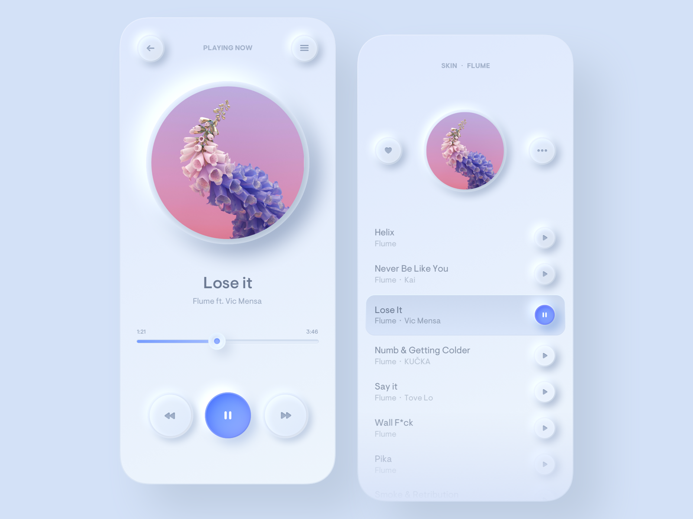

# Modern UI Neumorphism

|  |  |
|---|---|
||

## Neumorphic components

All components are perfectly in compliance with the neumorphism design trend making use of the specific shadow and coloring attributes. Neumorphism UI also comes with the shadow inset style add-on.


## Full documentation

Each component, plugin and the general workflow is well documented.

## Workflow

This product is built using the following widely used technologies:

- Most popular CSS Framework Bootstrap
- Productive workflow tool Gulp
- Awesome CSS preprocessor Sass

## Table of Contents

* [Demo](#demo)
* [Quick Start](#quick-start)
* [Documentation](#documentation)
* [File Structure](#file-structure)
* [Browser Support](#browser-support)
* [Resources](#resources)
* [Reporting Issues](#reporting-issues)
* [Technical Support or Questions](#technical-support-or-questions)
* [Licensing](#licensing)
* [Useful Links](#useful-links)

## Quick start

1. Download from https://github.com/Sreng-S/ModernUI-Neumorphism
2. Download the project's zip
3. Make sure you have Node locally installed.
4. Download Gulp Command Line Interface to be able to use gulp in your Terminal.

```
npm install gulp-cli -g
```

5. After installing Gulp, run npm install in the main `neumorphism/` folder to download all the project dependencies. You'll find them in the `node_modules/` folder.

```
npm install
```

6. Run gulp in the `neumorphism/` folder to serve the project files using BrowserSync. Running gulp will compile the theme and open `/index.html` in your main browser.

```
gulp
```

While the gulp command is running, files in the `assets/scss/`, `assets/js/` and `components/` folders will be monitored for changes. Files from the `assets/scss/` folder will generate injected CSS.

Hit `CTRL+C` to terminate the gulp command. This will stop the local server from running.

## Theme without Sass, Gulp or Npm

If you'd like to get a version of our theme without Sass, Gulp or Npm, we've got you covered. Run the following command:

```
gulp build:dev
```

This will generate a folder `html&css` which will have unminified CSS, Html and Javascript.

## Minified version

If you'd like to compile the code and get a minified version of the HTML and CSS just run the following Gulp command:

```
gulp build:dist
```

This will generate a folder `dist` which will have minified CSS, Html and Javascript.

## File Structure

Within the download you'll find the following directories and files:

```
Neumorphism UI
.
├── README.md
├── gulpfile.js
├── package.json
└── src
    ├── assets
    │   ├── img
    │   │   ├── blog
    │   │   ├── brand
    │   │   ├── carousel
    │   │   ├── checker_logo.png
    │   │   ├── clients
    │   │   ├── favicon
    │   │   ├── illustrations
    │   │   ├── macbook-mockup.png
    │   │   ├── megamenu-image.jpg
    │   │   ├── presentation
    │   │   ├── presentation-mockup.png
    │   │   ├── presentation-sections
    │   │   ├── sections
    │   │   ├── shop
    │   │   ├── signature.svg
    │   │   ├── team
    │   │   ├── themesberg.svg
    │   │   └── wavelogo.svg
    │   └── js
    │       └── neumorphism.js
    ├── html
    │   ├── components
    │   │   ├── accordions.html
    │   │   ├── alerts.html
    │   │   ├── all.html
    │   │   ├── badges.html
    │   │   ├── bootstrap-carousels.html
    │   │   ├── breadcrumbs.html
    │   │   ├── buttons.html
    │   │   ├── cards.html
    │   │   ├── forms.html
    │   │   ├── modals.html
    │   │   ├── navs.html
    │   │   ├── pagination.html
    │   │   ├── popovers.html
    │   │   ├── progress-bars.html
    │   │   ├── steps.html
    │   │   ├── tables.html
    │   │   ├── tabs.html
    │   │   ├── toasts.html
    │   │   ├── tooltips.html
    │   │   ├── typography.html
    │   │   └── widgets.html
    │   ├── pages
    │   │   ├── about.html
    │   │   ├── contact.html
    │   │   ├── pricing.html
    │   │   ├── sign-in.html
    │   │   └── sign-up.html
    ├── index.html
    ├── partials
    │   ├── _analytics.html
    │   ├── _footer.html
    │   ├── _head.html
    │   ├── _navigation.html
    │   ├── _pages-preview.html
    │   ├── _pricing.html
    │   ├── _scripts.html
    │   └── components
    │       ├── _accordions.html
    │       ├── _alerts.html
    │       ├── _badges.html
    │       ├── _bootstrap-carousels.html
    │       ├── _breadcrumbs.html
    │       ├── _buttons.html
    │       ├── _cards.html
    │       ├── _forms.html
    │       ├── _modals.html
    │       ├── _navs.html
    │       ├── _pagination.html
    │       ├── _popovers.html
    │       ├── _progress-bars.html
    │       ├── _steps.html
    │       ├── _tables.html
    │       ├── _tabs.html
    │       ├── _toasts.html
    │       ├── _tooltips.html
    │       ├── _typography.html
    └── scss
        ├── bootstrap
        │   ├── _alert.scss
        │   ├── _badge.scss
        │   ├── _breadcrumb.scss
        │   ├── _button-group.scss
        │   ├── _buttons.scss
        │   ├── _card.scss
        │   ├── _carousel.scss
        │   ├── _close.scss
        │   ├── _code.scss
        │   ├── _custom-forms.scss
        │   ├── _dropdown.scss
        │   ├── _forms.scss
        │   ├── _functions.scss
        │   ├── _grid.scss
        │   ├── _images.scss
        │   ├── _input-group.scss
        │   ├── _jumbotron.scss
        │   ├── _list-group.scss
        │   ├── _media.scss
        │   ├── _mixins.scss
        │   ├── _modal.scss
        │   ├── _nav.scss
        │   ├── _navbar.scss
        │   ├── _pagination.scss
        │   ├── _popover.scss
        │   ├── _print.scss
        │   ├── _progress.scss
        │   ├── _reboot.scss
        │   ├── _root.scss
        │   ├── _spinners.scss
        │   ├── _tables.scss
        │   ├── _toasts.scss
        │   ├── _tooltip.scss
        │   ├── _transitions.scss
        │   ├── _type.scss
        │   ├── _utilities.scss
        │   ├── _variables.scss
        │   ├── bootstrap-grid.scss
        │   ├── bootstrap-reboot.scss
        │   ├── bootstrap.scss
        │   ├── mixins
        │   ├── utilities
        │   └── vendor
        ├── neumorphism
        │   ├── _components.scss
        │   ├── _functions.scss
        │   ├── _layout.scss
        │   ├── _mixins.scss
        │   ├── _reboot.scss
        │   ├── _utilities.scss
        │   ├── _variables.scss
        │   ├── _vendor.scss
        │   ├── components
        │   ├── layout
        │   ├── mixins
        │   ├── utilities
        │   └── vendor
        └── neumorphism.scss
```

## Browser Support

At present, we officially aim to support the last two versions of the following browsers:

